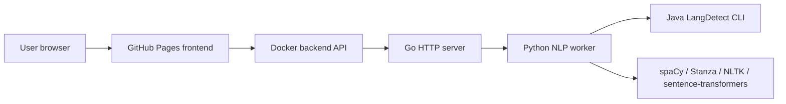

# Polyglot NLP Toolkit

Live site: https://baditaflorin.github.io/polyglot-nlp-toolkit/

Repository: https://github.com/baditaflorin/polyglot-nlp-toolkit

Docker image: ghcr.io/baditaflorin/polyglot-nlp-toolkit:latest

Polyglot NLP Toolkit replaces a pile of language-processing microservices with
one static GitHub Pages frontend and one Dockerized API that tokenizes, POS-tags,
parses, extracts entities, embeds, and clusters corpora across 70+ languages,
including Romanian.

## Quickstart

```sh
make install-hooks
npm --prefix frontend install
go mod download
make dev
make smoke
```

The frontend runs at http://localhost:5173/polyglot-nlp-toolkit/ and expects the
API at http://localhost:8080 by default.

## What It Does

- Load your own corpus from pasted text, HTML, CSV, TSV, JSON document arrays,
  multi-file upload, drag-and-drop, clipboard text, share URLs, or exported
  workspace state.
- Choose language detection, tokenization, POS, dependency parsing, NER,
  embeddings, and clustering.
- Resume after reload through local autosave, or start fresh with one click.
- Export analysis JSON, token CSV, workspace state, a share URL, a print view,
  and a curl command for the current request.
- Run the work through a Go API that orchestrates spaCy, Stanza, NLTK,
  sentence-transformers, and Java LangDetect.
- Publish the UI from GitHub Pages and deploy the backend as an amd64 Docker
  image. GHCR publishing is wired through `make docker-push`; it requires a
  running Docker daemon and registry access.

## Verified User Paths

- `npm test -- --run` covers schemas, input parsing, state import, JSON/CSV/curl
  exporters, and deterministic export helpers.
- `make smoke` builds the Pages app, serves it locally, and runs Playwright
  against project links plus the file-input/export-control workflow.

## Limitations

- The public Pages app is static. Analysis requires a running backend API.
- The browser cannot fetch arbitrary remote pages because of CORS. Paste rendered
  text or HTML instead.
- OCR/image input is not implemented.
- Large state is exported as a file rather than a share URL.

## Architecture



More detail: docs/architecture.md

ADRs: docs/adr/

API contract: api/openapi.yaml

Deployment guide: deploy/README.md

## Versioning

The Pages app displays both version and commit. `make build` injects
`APP_VERSION` from `git describe --tags` where available and `APP_COMMIT` from
the current short SHA.

## Environment

Configuration is via environment variables. See `.env.example`.

## Checks

```sh
make fmt
make lint
make test
make build
make smoke
```

## Support

If the project helps you, star it:

https://github.com/baditaflorin/polyglot-nlp-toolkit

Support development:

https://www.paypal.com/paypalme/florinbadita
