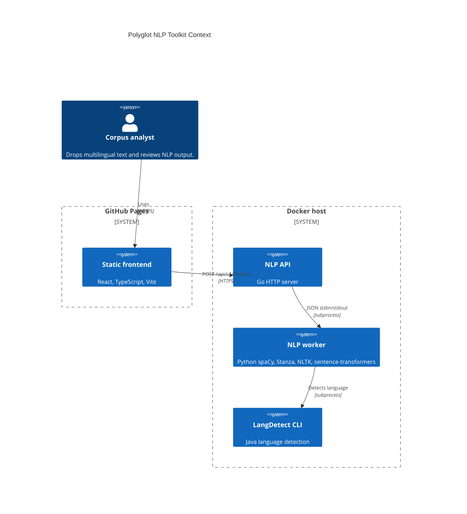
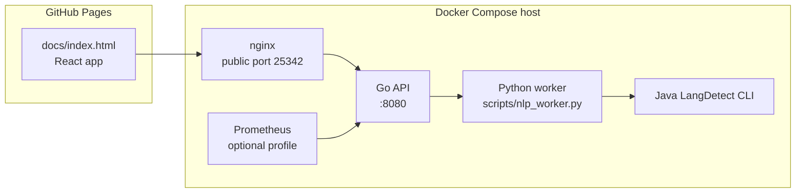

# Architecture

## Context

## Containers

## Module Boundaries

- `frontend/` owns user interaction and Pages build output.
- `internal/api/` owns REST endpoints, validation, and JSON responses.
- `internal/nlp/` owns the subprocess contract to Python.
- `scripts/nlp_worker.py` owns NLP library integration and graceful fallbacks.
- `tools/langdetect-java/` owns Java language detection.
- `deploy/` owns production Docker Compose, nginx, and Prometheus samples.
